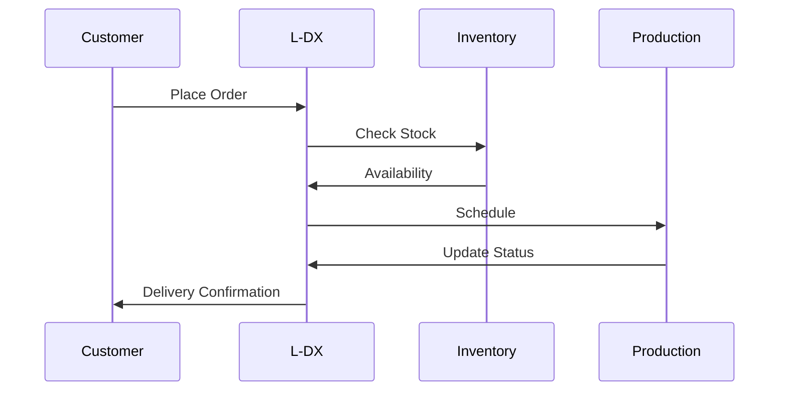

## Overview

L-DX delivers a unified cloud platform that links your order receipt, delivery, inventory, production, and cost data in real time. You gain visibility across your apparel supply chain, reducing stockouts and stagnation while maximizing profits. Connect L-DX to your ERP or existing systems for quick implementation and seamless adoption.

<Columns cols={2}>
  <Card title="Real-Time Tracking" icon="zap" href="#real-time-tracking">
    Monitor orders from receipt to delivery instantly.
  </Card>
  <Card title="Inventory Management" icon="package" href="#inventory-management">
    Prevent stockouts and overstock with smart alerts.
  </Card>
  <Card title="Production Scheduling" icon="calendar" href="#production-scheduling">
    Optimize schedules and analyze costs effectively.
  </Card>
  <Card title="Outstanding Orders" icon="file-text" href="#outstanding-orders">
    Track and report on pending orders with ease.
  </Card>
</Columns>

## Real-Time Order Receipt and Delivery Tracking

You track every order stage in L-DX, from customer receipt to final delivery. The system syncs data across platforms, providing live updates to your team.

<Callout kind="tip">
  Enable webhook notifications to integrate real-time updates with your ERP system.
</Callout>

Use the API to fetch live order status:

<CodeGroup tabs="JavaScript,Python">
  ```javascript
  const response = await fetch('https://api.example.com/v1/orders/12345', {
    headers: { Authorization: `Bearer ${YOUR_API_KEY}` }
  });
  const order = await response.json();
  console.log(order.status); // 'shipped'
  ```
  ```python
  import requests
  response = requests.get(
    'https://api.example.com/v1/orders/12345',
    headers={'Authorization': f'Bearer {YOUR_API_KEY}'}
  )
  order = response.json()
  print(order['status'])  # 'shipped'
  ```
</CodeGroup>



## Inventory Management

L-DX helps you maintain optimal stock levels. You receive alerts for low inventory or stagnation risks based on sales trends and lead times.

<Steps>
  <Step title="Set Thresholds" icon="settings">
    Configure min/max stock levels for each SKU in the dashboard.
  </Step>
  <Step title="Monitor Alerts" icon="bell">
    View real-time notifications for potential stockouts.
  </Step>
  <Step title="Replenish" icon="shopping-cart">
    Trigger purchase orders directly from the interface.
  </Step>
</Steps>

| Metric | Threshold | Action |
|--------|-----------|--------|
| Stockout Risk | `<10 units` | Auto-alert |
| Stagnation | `>90 days` | Review report |
| Overstock | `>200% max` | Adjust production |

## Production Scheduling and Cost Analysis

Schedule production runs efficiently and analyze costs per item. L-DX calculates real-time costs including materials, labor, and overhead.

<Tabs>
  <Tab title="Scheduling" icon="calendar">
    Assign tasks to teams with drag-and-drop in the scheduler.
  </Tab>
  <Tab title="Cost Breakdown" icon="bar-chart">
    
    ```javascript
    // Fetch cost analysis
    const costs = await fetch('https://api.example.com/v1/production/67890/costs').then(r => r.json());
    console.log(costs); // { materials: 15.50, labor: 8.20, total: 45.70 }
    ```
  </Tab>
</Tabs>

## Outstanding Orders Monitoring and Reporting

Monitor pending orders and generate reports on outstanding balances. You export data for finance reconciliation or sales forecasting.

<Expandable title="Advanced Reporting" default-open="false">
  Customize reports with filters for order age, value, and customer.
  
  <ParamField query="status" param-type="string" required="true">
    Filter by `pending`, `delayed`.
  </ParamField>
  
  <ParamField query="since" param-type="date">
    Orders since a specific date.
  </ParamField>
</Expandable>

<Callout kind="success">
  Integrate with your ERP to automate outstanding order syncing and reduce manual work.
</Callout>