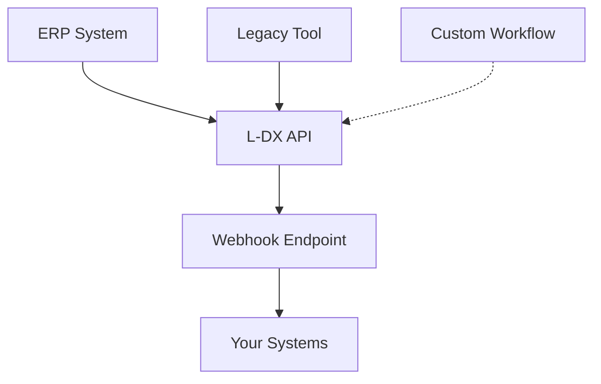

## Overview

L-DX supports flexible integrations with ERP systems, legacy tools, and custom workflows to enable real-time data synchronization across inventory, production, orders, and costs. You achieve seamless connections that reduce stock stagnation and support short-term on-site adoption.

<Callout kind="tip">
  Start with webhooks for quick real-time updates, then expand to full ERP linkages for comprehensive data flow.
</Callout>

## Available Integration Methods

Choose the method that fits your setup. L-DX provides APIs, webhooks, and direct connectors for apparel-specific workflows.

<Columns cols={3}>
  <Card title="ERP Connectors" icon="database" href="#erp-setup">
    Pre-built connectors for popular ERP systems like SAP and Oracle.
  </Card>
  <Card title="Webhooks" icon="zap" href="#webhooks">
    Real-time event notifications for orders, inventory, and deliveries.
  </Card>
  <Card title="Custom APIs" icon="code" href="#custom-integrations">
    RESTful APIs for tailored apparel production and cost management.
  </Card>
</Columns>

## Setting Up ERP Connections

Connect L-DX to your ERP system using OAuth2 authentication and scheduled syncs. This ensures real-time linkage of orders, inventory, and outstanding balances.

<Steps>
  <Step title="Generate API Key" icon="key">
    Log in to your L-DX dashboard at `https://dashboard.example.com`. Navigate to **Settings > Integrations** and create a new API key for ERP access.
  </Step>
  <Step title="Configure ERP Endpoint" icon="settings">
    In your ERP admin panel, add the L-DX endpoint: `https://api.example.com/ldx/v1/erp/sync`.
  </Step>
  <Step title="Test Sync" icon="play">
    Trigger a test sync to verify order and inventory data flows correctly.
  </Step>
</Steps>

<CodeGroup tabs="JavaScript,Python">
  ```javascript
  const response = await fetch('https://api.example.com/ldx/v1/erp/sync', {
    method: 'POST',
    headers: {
      'Authorization': 'Bearer YOUR_API_KEY',
      'Content-Type': 'application/json'
    },
    body: JSON.stringify({
      orders: [{ id: 'ORD-123', status: 'shipped' }],
      inventory: [{ sku: 'APP-456', qty: 100 }]
    })
  });
  ```
  ```python
  import requests

  response = requests.post(
      'https://api.example.com/ldx/v1/erp/sync',
      headers={
          'Authorization': 'Bearer YOUR_API_KEY',
          'Content-Type': 'application/json'
      },
      json={
          'orders': [{'id': 'ORD-123', 'status': 'shipped'}],
          'inventory': [{'sku': 'APP-456', 'qty': 100}]
      }
  )
  ```
</CodeGroup>

## Configuring Webhooks for Real-Time Sync

Set up webhooks to receive instant updates on order receipt, delivery, inventory changes, and cost adjustments. Point them to your endpoint at `https://your-webhook-url.com/webhook`.

<Tabs>
  <Tab title="Inventory Update" icon="package">
    <ParamField path="event" param-type="string" required="true">
      Event type, e.g., `inventory.updated`.
    </ParamField>
    <ParamField body="sku" param-type="string" required="true">
      Apparel SKU identifier.
    </ParamField>
    <ParamField body="quantity" param-type="number">
      Updated stock quantity.
    </ParamField>

    ```javascript
    app.post('/webhook', (req, res) => {
      const { event, sku, quantity } = req.body;
      if (event === 'inventory.updated') {
        updateLocalStock(sku, quantity);
      }
      res.status(200).send('OK');
    });
    ```
  </Tab>
  <Tab title="Order Shipped" icon="truck">
    Handle shipment notifications to reduce stockouts.

    ```javascript
    app.post('/webhook', (req, res) => {
      const { event, orderId, tracking } = req.body;
      if (event === 'order.shipped') {
        sendTrackingEmail(orderId, tracking);
      }
      res.status(200).send('OK');
    });
    ```
  </Tab>
</Tabs>

## Custom Integration Options for Apparel Workflows

<Expandable title="Advanced Custom API Usage" default-open="false">

Build bespoke integrations for production scheduling and cost tracking. Use the L-DX REST API at `https://api.example.com/ldx/v1/` with endpoints like `/production/orders` and `/costs/calculate`.

```javascript
const productionData = {
  orderId: 'PROD-789',
  items: [
    { sku: 'SHIRT-001', qty: 50, fabric: 'cotton' }
  ],
  deadline: '2024-12-01'
};

await fetch('https://api.example.com/ldx/v1/production/orders', {
  method: 'POST',
  headers: { 'Authorization': 'Bearer YOUR_API_KEY' },
  body: JSON.stringify(productionData)
});
```

</Expandable>



## Best Practices for Short-Term Adoption

<Callout kind="alert">
  Test integrations in staging first. Monitor sync logs in the L-DX dashboard to catch discrepancies early.
</Callout>

- Prioritize webhooks for real-time needs like inventory alerts.
- Use batch syncs for large ERP datasets to avoid rate limits.
- Implement idempotency keys in payloads to handle retries safely.
- Schedule weekly audits to ensure data accuracy across systems.

These practices enable rapid on-site rollout, minimizing disruptions while maximizing L-DX benefits for apparel operations.