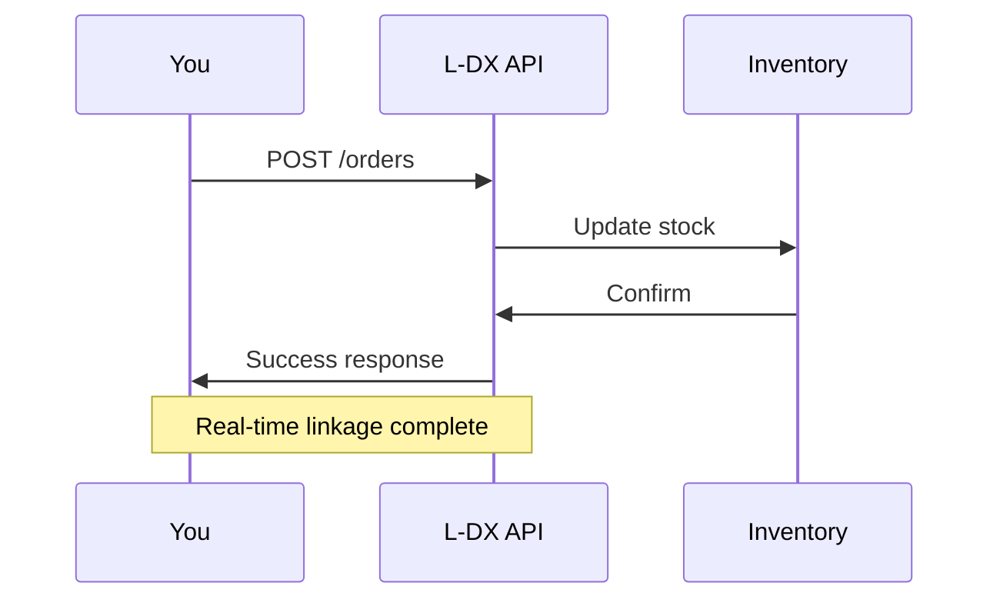

## Prerequisites

<Callout kind="info">

Before starting, ensure you have:
- An active email address for account registration
- Access to your apparel business data (orders, inventory CSV or API)
- Admin permissions for any ERP systems you plan to connect

Estimated time: `<10` minutes.

</Callout>

## Create Your L-DX Account

Follow these steps to register and log in to the L-DX dashboard.

<Steps>
  <Step title="Sign Up" icon="user-plus">

    Visit [https://dashboard.example.com/signup](https://dashboard.example.com/signup).

    Fill in your business details:
    - Company name (e.g., "FashionCorp")
    - Email address
    - Password (minimum 12 characters)

    Click **Create Account**. You receive a verification email.

  </Step>
  <Step title="Verify Email" icon="mail">

    Check your inbox and click the verification link.

    <Callout kind="tip">
      If no email arrives in 5 minutes, check spam or resend from the login page.
    </Callout>

  </Step>
  <Step title="Log In" icon="log-in">

    Go to [https://dashboard.example.com/login](https://dashboard.example.com/login).

    Enter your credentials and select **Log In**.

  </Step>
</Steps>

## Initial System Configuration

Configure L-DX for your apparel business. Use the dashboard wizard at first login.

<Tabs>
  <Tab title="Retail Store" icon="store">

    1. Select **Retail** business type.
    2. Set store locations (e.g., "NYC Flagship", "LA Outlet").
    3. Define seasons: `Spring 2024`, `Fall 2024`.

  </Tab>
  <Tab title="Manufacturer" icon="factory">

    1. Select **Manufacturing** type.
    2. Input production lines (e.g., "T-Shirts", "Jeans").
    3. Set cost centers: `Fabric`, `Labor`.

  </Tab>
  <Tab title="Wholesaler" icon="package">

    1. Select **Wholesale** type.
    2. Add warehouse addresses.
    3. Configure order minimums: `{minQuantity: 100}`.

  </Tab>
</Tabs>

## Connect Order and Inventory Data

Link your data sources via API. L-DX uses REST endpoints for real-time sync.

<CodeGroup tabs="cURL,JavaScript,Python">
  ```bash
  curl -X POST https://api.example.com/v1/orders \
    -H "Authorization: Bearer YOUR_API_KEY" \
    -H "Content-Type: application/json" \
    -d '{
      "orderId": "ORD-12345",
      "items": [{"sku": "TSHIRT-BLUE-M", "quantity": 50}],
      "deliveryDate": "2024-10-15"
    }'
  ```
  ```javascript
  const response = await fetch('https://api.example.com/v1/orders', {
    method: 'POST',
    headers: {
      'Authorization': 'Bearer YOUR_API_KEY',
      'Content-Type': 'application/json'
    },
    body: JSON.stringify({
      orderId: 'ORD-12345',
      items: [{ sku: 'TSHIRT-BLUE-M', quantity: 50 }],
      deliveryDate: '2024-10-15'
    })
  });
  ```
  ```python
  import requests

  response = requests.post(
      'https://api.example.com/v1/orders',
      headers={
          'Authorization': 'Bearer YOUR_API_KEY',
          'Content-Type': 'application/json'
      },
      json={
          'orderId': 'ORD-12345',
          'items': [{'sku': 'TSHIRT-BLUE-M', 'quantity': 50}],
          'deliveryDate': '2024-10-15'
      }
  )
  ```
</CodeGroup>

<ParamField path="orderId" param-type="string" required="true">
  Unique order identifier from your ERP.
</ParamField>

<ParamField path="items" param-type="array" required="true">
  Array of products with SKU and quantity.
</ParamField>

For inventory, repeat with `POST /v1/inventory`.

## Run Your First Real-Time Linkage Test

Verify integration works.

<Steps>
  <Step title="Place Test Order" icon="shopping-cart">

    Use the dashboard **Test Data** tab to simulate an order receipt.

  </Step>
  <Step title="Check Sync" icon="refresh-cw">

    Navigate to **Real-Time Dashboard**.

    Confirm:
    - Inventory updates (`<50` units remaining for TSHIRT-BLUE-M)
    - Outstanding orders list populates
    - No stockouts flagged

  </Step>
  <Step title="View Reports" icon="bar-chart-3">

    Generate **Profit Impact Report**. Expect reduced stagnation metrics.

  </Step>
</Steps>



## Next Steps

<Columns cols={3}>
  <Card title="Authentication" icon="lock" href="/authentication">
    Secure your API connections with tokens.
  </Card>
  <Card title="Configuration" icon="settings" href="/configuration">
    Advanced ERP integrations and custom rules.
  </Card>
  <Card title="Introduction" icon="book-open" href="/introduction">
    Full L-DX overview and features.
  </Card>
</Columns>

<Callout kind="success">
  Congratulations! Your L-DX setup enables real-time apparel management. Monitor the dashboard for ongoing optimizations.
</Callout>